# California Traffic Collision ETL & Analysis

This repository contains an end-to-end workflow for processing and analyzing California traffic collision data using PySpark, Spark SQL, SQLite, and AWS S3. The project performs extraction, transformation, standardization, and visualization of collision records sourced from the Statewide Integrated Traffic Records System (SWITRS).

## Dataset Source

The dataset is provided in SQLite format and includes structured tables for:
- collisions
- parties
- victims

## Technology Stack

- Python
- SQLite
- Pandas
- Apache Spark (PySpark)
- Spark SQL
- AWS S3
- Google Colab

## Data Extraction

```python
conn = sqlite3.connect('/content/.../collisions.db')
df = pd.read_sql_query("SELECT * FROM collisions", conn)
spark_df = spark.createDataFrame(df)
```

## Transformations

Operations applied in the notebook:
- column renaming
- derived field creation
- recoding
- schema reordering
- Spark SQL view creation

Example:
```python
df_main = df_main.withColumn(
    "hit_and_run_flag",
    when(col("hit_and_run") == "no", 0).otherwise(1)
)
```

## Export to S3

```python
df_final.write.csv("s3://<bucket>/traffic-collisions/", header=True)
```

## Charts Generated

Below charts were extracted from the notebook:

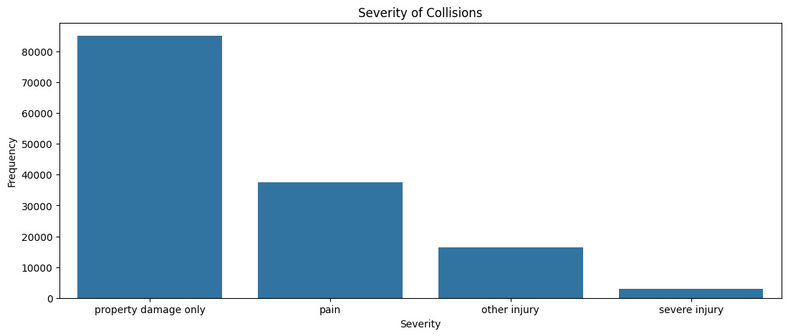
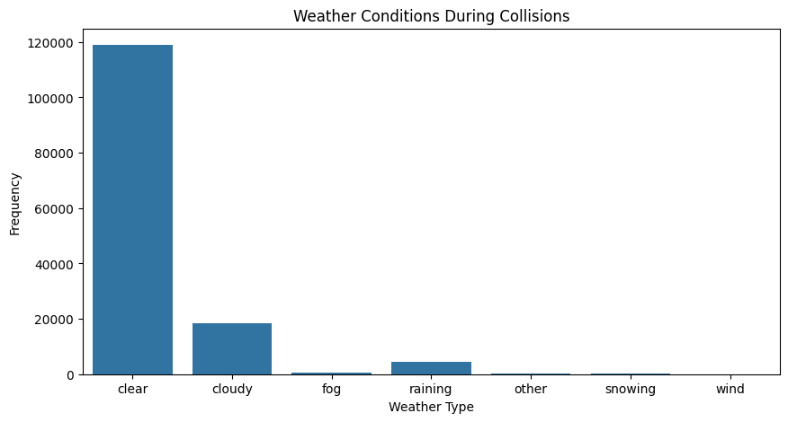
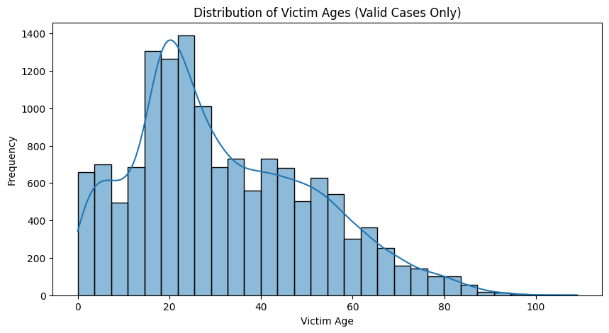
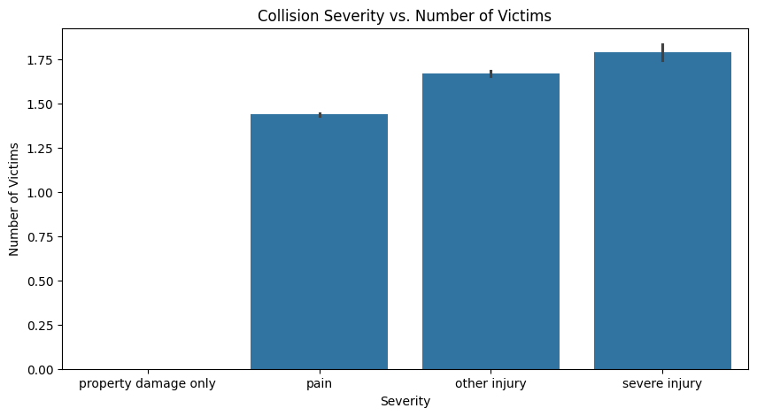
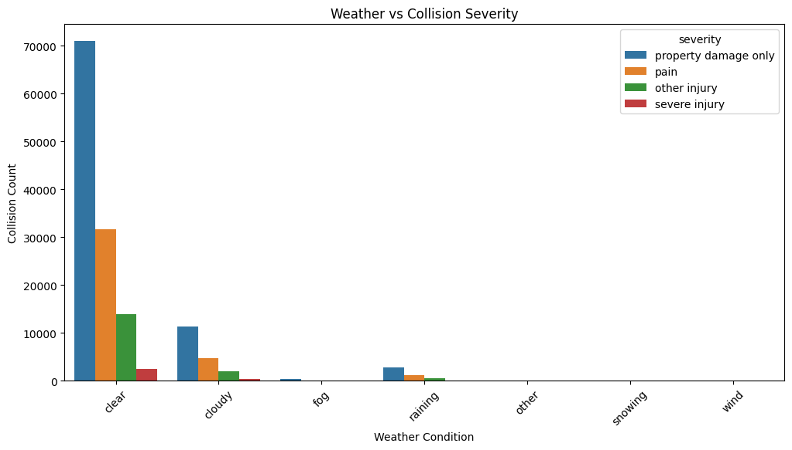
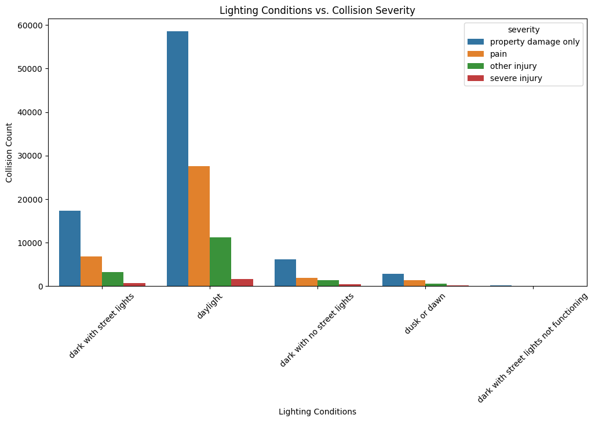

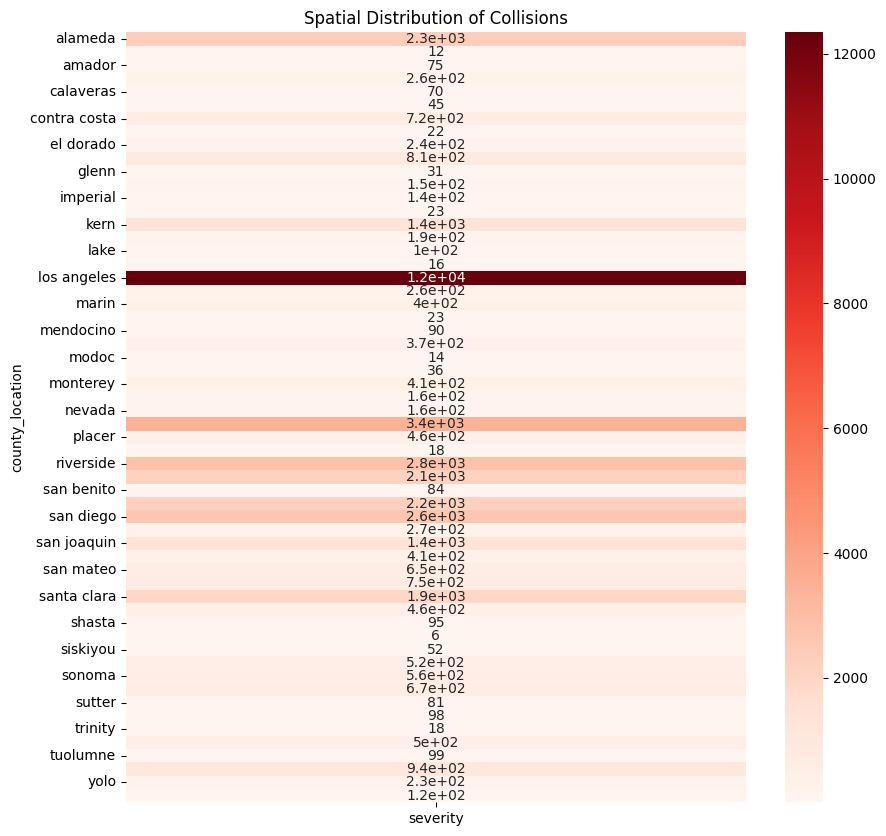
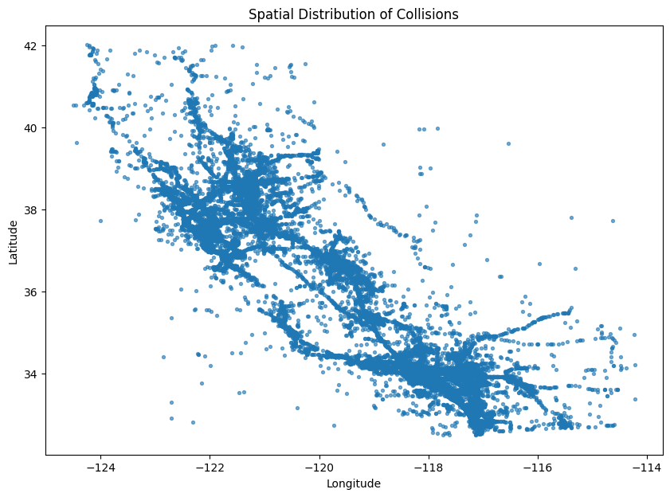
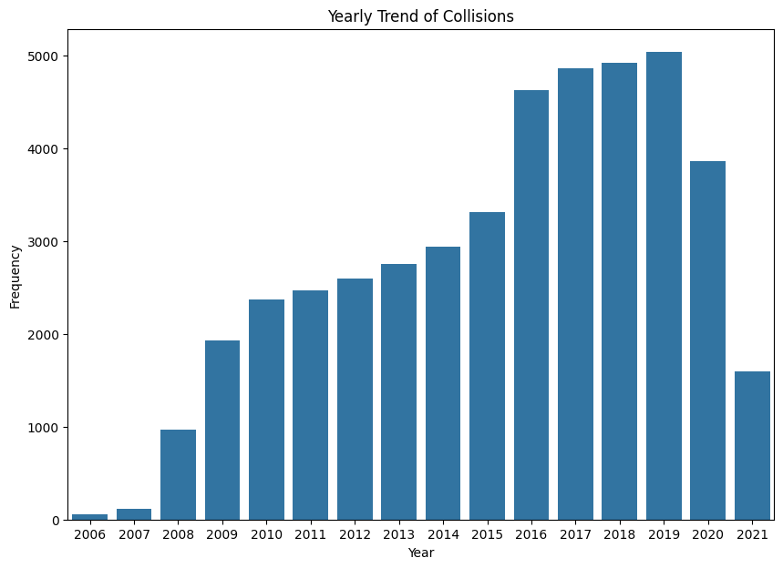
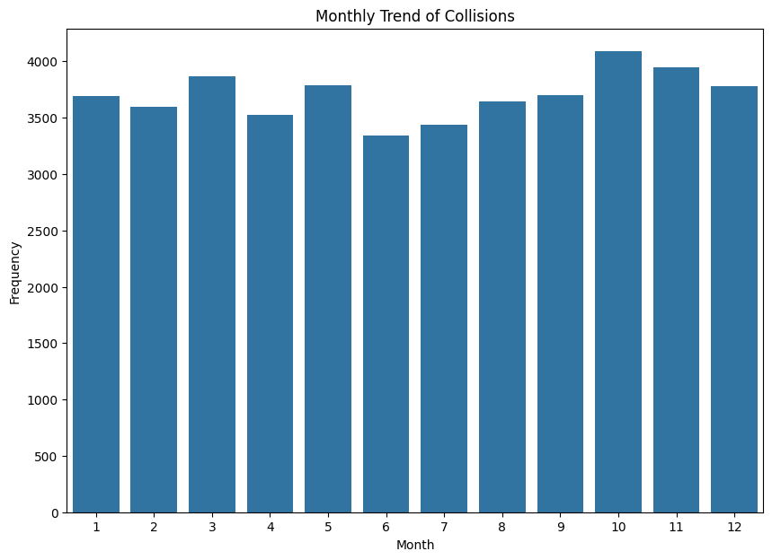
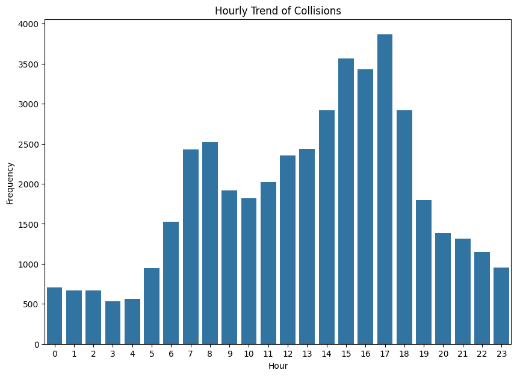

## Outputs

This project produces:
- cleaned Spark DataFrame
- SQL-ready Spark view
- S3 CSV export
- visualization outputs

## Repo Structure

```
traffic-collisions-etl/
├── assets/
├── notebooks/
├── scripts/
├── data/
└── README.md
```

## Author

Piyush Sharma
PGD Data Science & AI — IIITB
